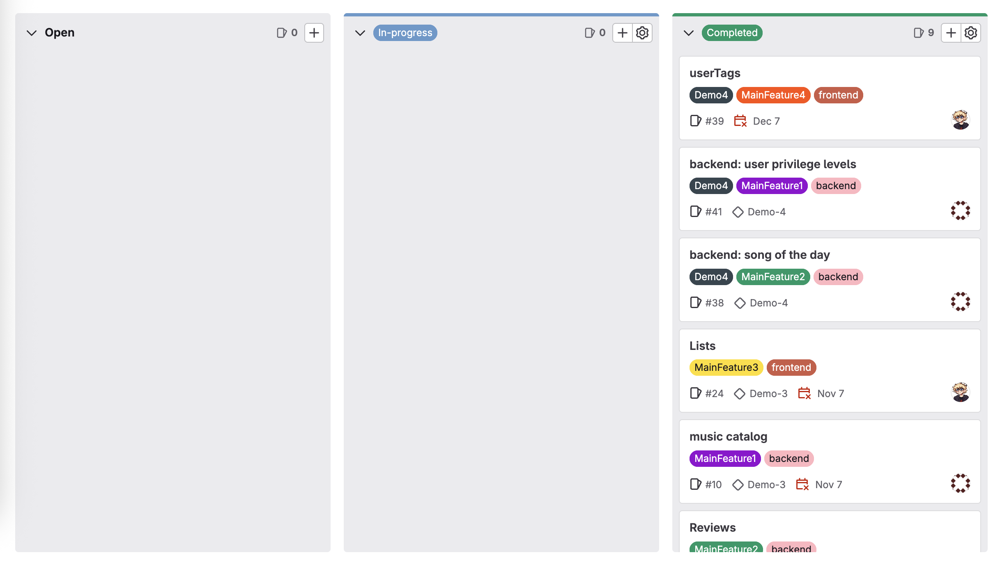
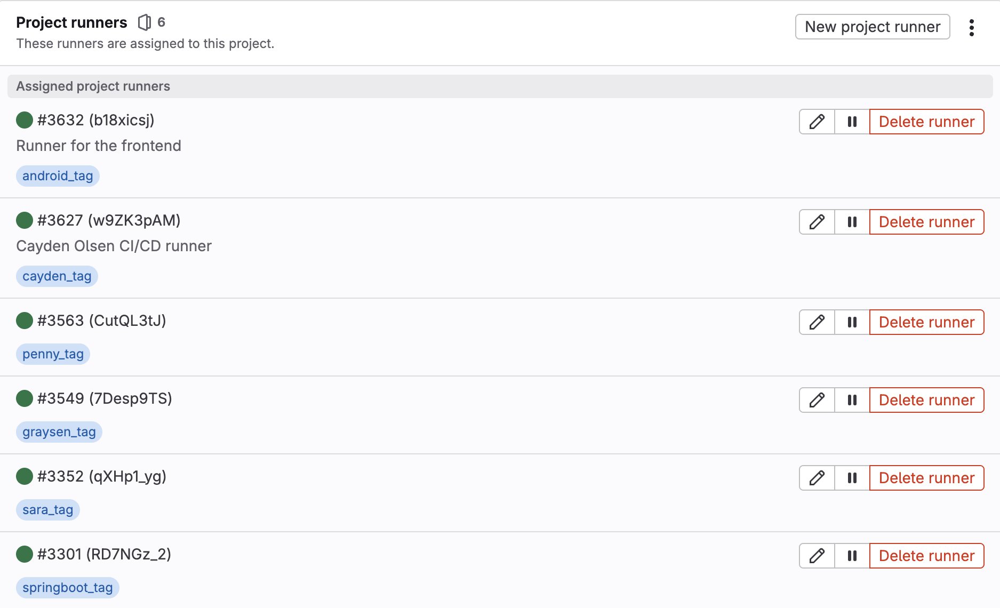

# iMP3 Project
Full stack system using Android Studio and Springboot. iMP3 was developed by 4 people, Cayden Olsen, 
Graysen Schwaller, Penny Mayer, and Sara Theriault over the course of the Fall 2025 semester for
COM S 3090 at Iowa State University. iMP3 is a music exploration app inspired by Letterboxd.

## Description
The iMP3 Project is a full-stack music application that mimics key features of modern streaming platforms. Users can:
- Express their interests by customizing their own profile with their name, username, profile picture,
  bio, and custom user tags
- Connect their Spotify acount via Spotify API
- Browse through a collection of albums, songs, and artists
- Leave a review on different music for other users to see
- Add music to custom playlists and express their taste
- Connect with other users by following
- Interact with others via live websocket chat and notification systems
- Send music recommendations to other users
- Get recommendations from Gemini AI based on Spotify account data
- Vote on a random "song of the day" once every day

## Disclaimers
* iMP3 is an academic project with Iowa State University and belongs to Cayden Olsen, 
Graysen Schwaller, Penny Mayer, and Sara Theriault. This project is for viewing purposes only
* All frontend classes & methods developed by myself are labeled with /** @author Cayden Olsen **/
* Since the project's server was based on an Iowa State University domain, the server is no longer
active as of 12/10/2025. Please watch [this video](https://youtu.be/kHMzPLT80t8) to see the app's functionality.

## Tech Overview
- **Backend**: Java 17, Spring Boot 3, Maven, JPA (Hibernate), MariaDB
- **Frontend**: Android Studio (Java & Xml), using Volley for REST and WebSocket API communication
- **Architecture**: REST + WebSocket hybrid with Model-View-Controller organization
- **API**: Spotify and Gemini Generative Language

## Git Usage
COM S 3090 uses Gitlab to replicate a professional full stack environment
* Use Git version control with staging, committing, pushing, merging, and pulling
* iMP3 was developed with over 600 commits and 50 branches to create our
  own work/group environment
* Use labels, issues, and the issue board

* Use CI/CD for continuous development

## Visuals
All visual requirements for this project are located in the /Documents/ProjectMedia 
directory named 'PO3_BlockDiagramsAndApi' and 'Screen_Sketches_2_jubair_2'

## Documentation
Frontend developers were required to create JavaDocs for 2 of their classes using
Android Studio. My JavaDocs are located in /Documents/MusicCatalogue_JavaDoc and
/Documents/NotificationsPage_JavaDoc

## Authors and Acknowledgment
- **Jubair Mostafa**: Team lead/Teaching Assistant
- **Sara Theriault**: Backend Developer
- **Penny Mayer**: Backend Developer
- **Cayden Olsen**: Frontend Developer
- **Graysen Schwaller**: Frontend Developer
